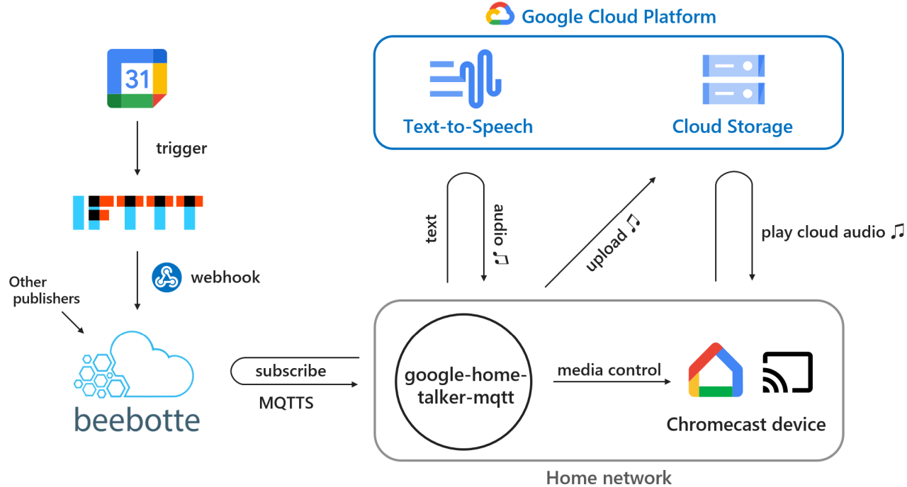
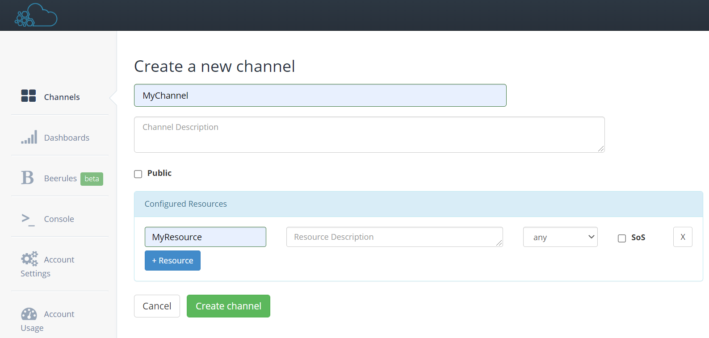
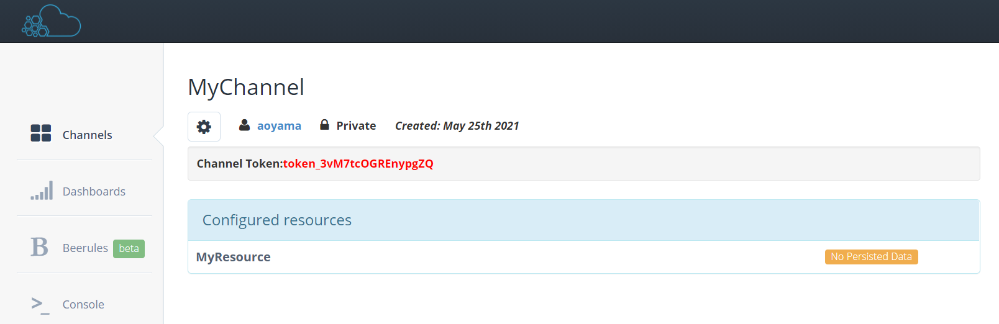
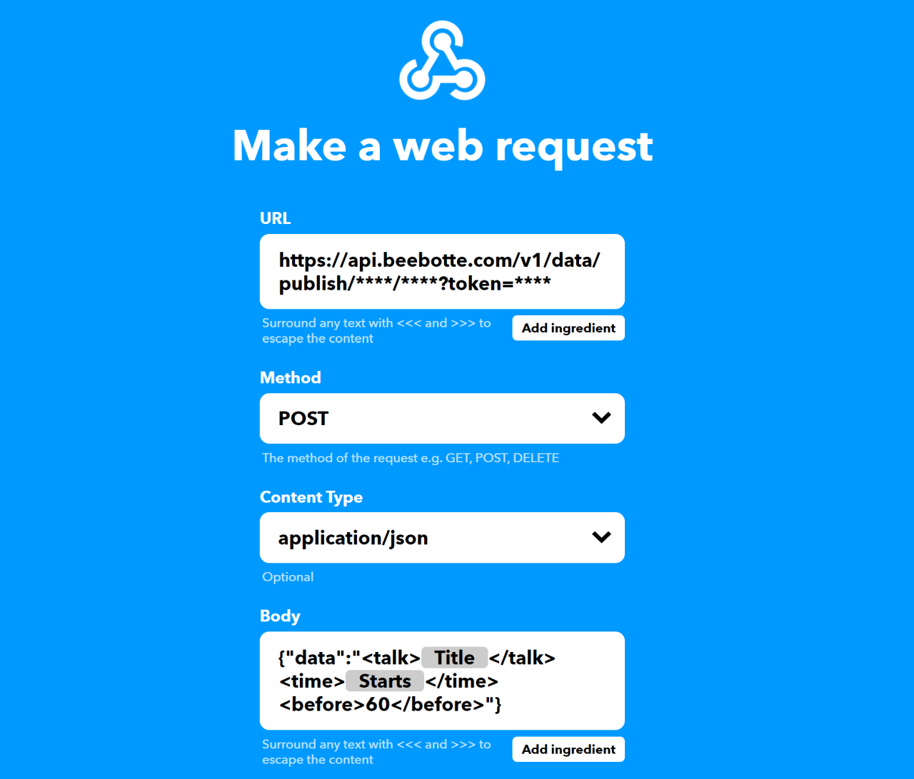

# Google Home Talker MQTT

**[日本語ページはこちら](./README_ja.md)**

## What's this

* This code enables Google Home (and other chromecast devices) to talk with IFTTT or other triggers
    * Motivation: I wanted my smart speaker to notify my schedule exactly one minute before
* Full SSL/TLS Internet connections


---
## Index
* [Overview](#overview)
* [Install](#install)
    * [Run Automatically](#install_systemd)
    * [Configurations](#configurations)
    * [Message Format](#message_format)
* [Related Cloud Services](#cloud_services)
    * [Google Text-to-Speech](#gtts)
    * [Google Cloud Storage](#gcs)
    * [Beebotte](#beebotte)
    * [IFTTT](#ifttt)

---
<a id="overview"></a>
## Overview



---
<a id="install"></a>
## Install

#### Download
```
git clone https://github.com/HidekiA/google-home-talker-mqtt
```

#### Install packages
```
pip install --upgrade pychromecast
pip install --upgrade google-cloud-texttospeech
pip install --upgrade google-cloud-storage
pip install --upgrade paho-mqtt
pip install --upgrade parse
```

#### Configuration
Edit [configurations.py](./configurations.py) (See [Configurations](#configurations) section)

#### Run
```
cd google-home-talker-mqtt
python3 main.py
```

#### Test
(After [Beebotte configurations](#beebotte))  
**(Replace *CHANNEL_NAME*, *RESOURCE_NAME*, and *TOKEN_STRING*)**
```
curl -X POST -H "Content-Type: application/json" -d '{"data":"Hello world!"}' https://api.beebotte.com/v1/data/publish/CHANNEL_NAME/RESOURCE_NAME?token=TOKEN_STRING
```

Example of cron to have a wake-up call at 7 a.m. on weekdays.
```
0 7 * * 1-5 /usr/bin/curl -X POST -H "Content-Type: application/json" -d '{"data":"Good morning!"}' https://api.beebotte.com/v1/data/publish/CHANNEL_NAME/RESOURCE_NAME?token=TOKEN_STRING
```


<a id="install_systemd"></a>
### Run Automatically (by systemd)

#### To set up a system service
1. Replace **ExecStart** path in [google-home-talker-mqtt@.service](./google-home-talker-mqtt@.service)
```
ExecStart=/usr/bin/python3 /home/USERNAME/google-home-talker-mqtt/main.py
```
2. Copy Unit file
```
sudo cp google-home-talker-mqtt@.service /etc/systemd/system/
```
3. Enable and Start the service.  
**(Replace *USRENAME* with the actual user name)**
```
systemctl enable google-home-talker-mqtt@USRENAME.service
systemctl start google-home-talker-mqtt@USRENAME.service
```

#### To check the service status
```
systemctl status google-home-talker-mqtt@USRENAME.service
```

#### To see the logs
```
journalctl -e -u google-home-talker-mqtt@USRENAME.service
```

---
<a id="configurations"></a>
## Configurations

### General
|  |  |
|---|---|
| CHROMECAST_DEVICE_IP | IP address of the chromecast device (Google Home / Google Nest / Smart TV, etc.)<br>This is shown in the Device Info page of "Home" App. |
| POLLING_INTERVAL | Polling interval to check for scheduled talk [second] |

### Text-to-Speech
|  |  |
|---|---|
| TTS_ACCOUNT_JSON | File name of service account key of Google Cloud Text-to-Speech ([How to get the key file](#gtts))|
| TTS_DEFAULT_LANGUAGE | Text to talk to |
| TTS_CHECK_JAPANESE | Use ja-JP if the text includes Japanese (and Chinese) character, `TTS_CHECK_JAPANESE` otherwise.<br>Set False when you use Chinese text. |
| TTS_GENDER | Voice gender (Details in [the official document](https://cloud.google.com/text-to-speech/docs/reference/rest/v1/SsmlVoiceGender))<br>- *texttospeech.SsmlVoiceGender.SSML_VOICE_GENDER_UNSPECIFIED*<br>- *texttospeech.SsmlVoiceGender.MALE*<br>- *texttospeech.SsmlVoiceGender.FEMALE*<br>（*SSML_VOICE_GENDER_UNSPECIFIED* is not a neutral voice, but seems to be either a male or female voice depending on the specified language. *NEUTRAL* has not yet supported.) |
| TTS_SPEED | Talk speed (0.25 - 4) |
| TTS_PITCH | Voice pitch (-20 - 20) |
| TTS_GAIN_DB | Volume (-96 - 16) |
| TTS_PROFILE | Optimization profile for the speaker device<br>See [the official document](https://cloud.google.com/text-to-speech/docs/audio-profiles?hl=ja) for available profiles. |


### Google Cloud Storage
|  |  |
|---|---|
| GCS_ACCOUNT_JSON | File name of service account key of Google Cloud Storage<br>This can be same as the one for Text-to-Speech. |
| BUCKET_NAME | Bucket name to store the temporary audio file |
| TTS_TEMPORARY_AUDIO_FILENAME | Name of the audio temporary file<br>This will be overwritten but not automatically removed. |


### Beebotte
|  |  |
|---|---|
| MQTT_CACERT | Server Certificates of the Beebotte server<br>Download https://beebotte.com/certs/mqtt.beebotte.com.pem |
| MQTT_TOPIC | MQTT topic ("*CHANNEL_NAME*/*RESOURCE_NAME*") |
| MQTT_TOKEN | Beebotte channel token (See [bellow](#beebotte).) |


---
<a id="message_format"></a>
## Message Format
|  |  |
|---|---|
| `<talk>` | Text to talk to<br>If there is no `<talk>` field, the entire message is taken as the text to talk to. |
| `<time>` (optional) | Make schedule to talk.<br> Accept any of [dateutil.parser formats](https://dateutil.readthedocs.io/en/stable/parser.html).<br>Talk immediately if a past time is specified. |
| `<before>` (optional) | Shift the time specified in `<time>` field. |

Examples:
```
<talk>Hello world!</talk>
>> Say "Hello world!" immediately

Hello world!
>> Say "Hello world!" immediately

<talk>Happy New Year!</talk><time>Jan 1, 2030 at 9:00AM</time>
>> Say "Happy New Year!" at 9am on January 1, 2030

<talk>The meeting will begin soon.</talk><time>15:30</time><before>60</before>
>> Say "The meeting will begin soon." at 15:29 today
```


---
<a id="cloud_services"></a>
# Related Cloud Services
## Google Cloud Platform


<a id="gtts"></a>
### Google Text-to-Speech
1. Make a service account and download a service account key file, following [the official manual](https://cloud.google.com/text-to-speech/docs/libraries?hl=JA).

1. Enable Text-to-Speech API  
https://console.cloud.google.com/marketplace/product/google/texttospeech.googleapis.com  
Free up to 1 Million characters per month (as of May 2021)


<a id="gcs"></a>
### Google Cloud Storage
1. Make a bucket in [Google Cloud Storage](https://console.cloud.google.com/storage/browser)  
Free up to 5GB and 5,000 times operations per month with the following settings (as of May 2021)

|  |  |
|---|---|
| Location type | Region |
| Location | us-west1 (or us-central1 or us-east1)   |
| Storage class | Standard |


<a id="beebotte"></a>
## Beebotte

1. Sign-up [Beebotte](https://beebotte.com/home)
1. Make a new *Channel* and a new *Resource*

1. Copy the channel token string to the `MQTT_TOKEN`



<a id="ifttt"></a>
## IFTTT

1. Sign-up [IFTTT](https://ifttt.com/)
1. Create an *Applet*
1. Press **If This** and set a trigger
    * For example, select *Google Calendar*, and select *Any event starts*.  
      And set a calendar in *Which calendar* field and *15 minutes* in *Time before event starts* filed
        * Note that IFTTT triggers tend to be a minute or two late
1. Press **Then That** and select *Webhooks* with the following settings
    * Replace *CHANNEL_NAME*, *RESOURCE_NAME*, and *TOKEN_STRING*
    * *Body* is an example to talk *Schedule title* one minute before the schedule starts
    

|  |  |
|---|---|
| URL | https://api.beebotte.com/v1/data/publish/CHANNEL_NAME/RESOURCE_NAME?token=TOKEN_STRING |
| Method | POST |
| Content Type | application/json |
| Body | `{"data":"<talk>{{Title}}</talk><time>{{Starts}}</time><before>60</before>"}` |
